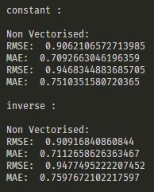

# ES654-2020 Assignment 3

*N. V. Karthikeya* - *17110090*

------

> In this question I have implemented non vectorized form of gradient descent without using any functions of pandas and numpy. It is slower when compared to other implementations as it has nested for loops for update.

> The results on random dataset are as follows

