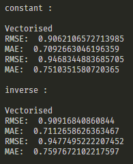

# ES654-2020 Assignment 3

*N. V. Karthikeya* - *17110090*

------

> In this question I have implemented vectorized form of gradient descent by using functions of numpy. It is faster than non vectorized method.

> The results on random dataset are as follows

