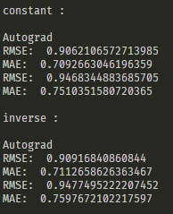

# ES654-2020 Assignment 3

*N. V. Karthikeya* - *17110090*

------

> In this question I have implemented gradient descent in vectorized form by using autograd to update thetas. Autograd is very helpful when the error functions are more complex in such cases we dont need to manually derivate.

> The results on random dataset are as follows

