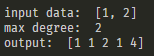

# ES654-2020 Assignment 3

*N. V. Karthikeya* - *17110090*

------

> In this question I have generated polynomial features for specified max degree and returned the new dataset
> Here is an example

