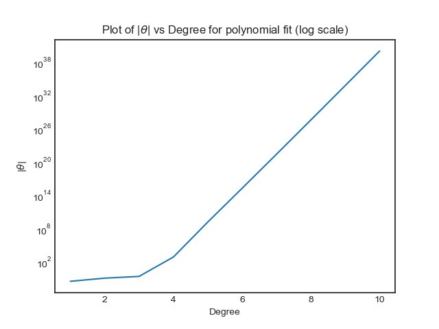

# ES654-2020 Assignment 3

*N. V. Karthikeya* - *17110090*

------

> In this question I have used the polynomial features for a given dataset to train the model and here is the plot of theta vs degree:

> The plot is as follows,

> Interpretation: As we increase the maximum degree the model gets more flexibility to increase the number of turns (i.e convex to concave or vice versa) in order to fit all the data points properly in this higher order polynomial the model will choose thetas whos absolute values are pretty high.