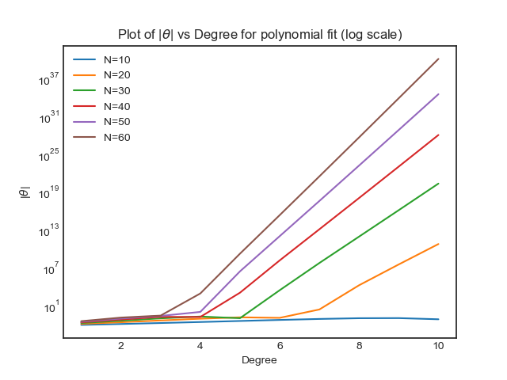

# ES654-2020 Assignment 3

*N. V. Karthikeya* - *17110090*

------

> In this question I have plotted the theta vs degree plot by variying the number of samples(N).

> The plot is as follows,

> Interpretation: As we increase the number of samples to train the model, it tries to accurately fit all these points. Ex: few points may fit in $3x^2 -4x+1$ whereas if we add  more points the same cure would try to become more accurate on test data and it may become $6x^2-10x+3$, in order to fit accurately coeffiecients would become more positive and more negative based on their initial signs. So fitting fewer points for a fixed max order would usually have lower coefficients when compared to that of fitting more samples.