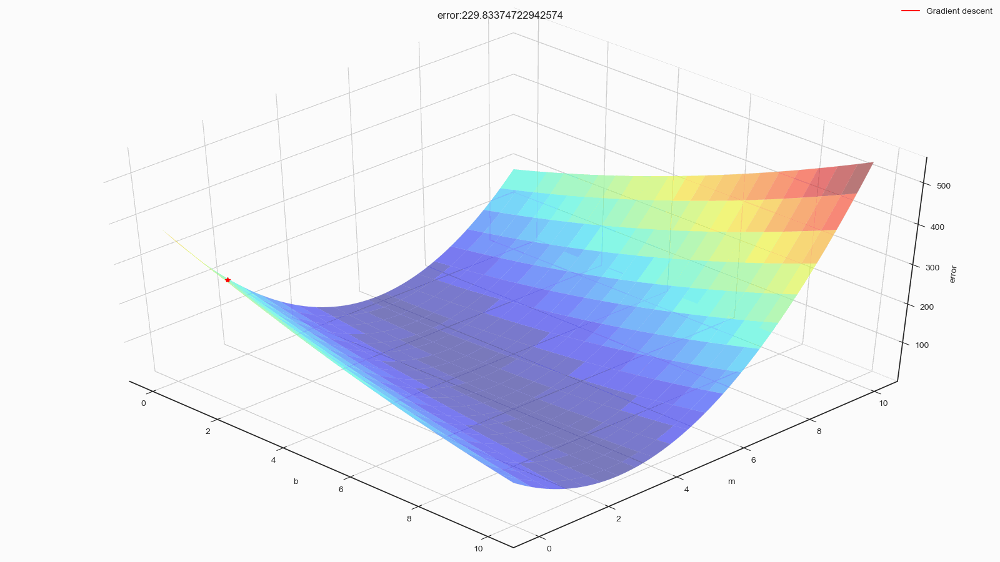
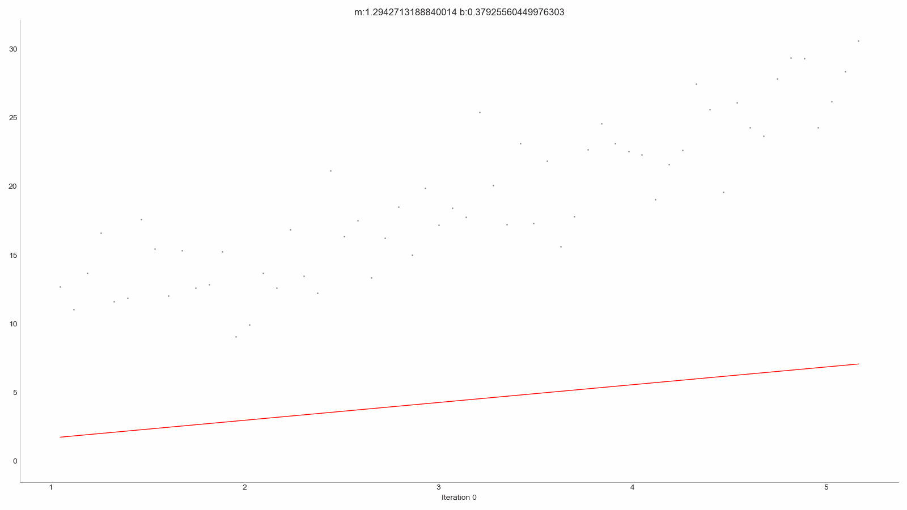

# ES654-2020 Assignment 3

*N. V. Karthikeya* - *17110090*

------

> In this question I have made the animations for the surface, contour and line fit for gradient descent.

> The plots are as follows,

- Surface plot for Constant Learning rate

- Surface plot for Inverse Learning rate

- Contour plot for Constant Learning rate

- Contour plot for Inverse Learning rate

- Line fit plot for Constant Learning rate

- Line fit plot for Inverse Learning rate

> Interpretation: This plots aided in analysing the proper learning rate for given dataset and helped in understanding how the error gradually decreases.