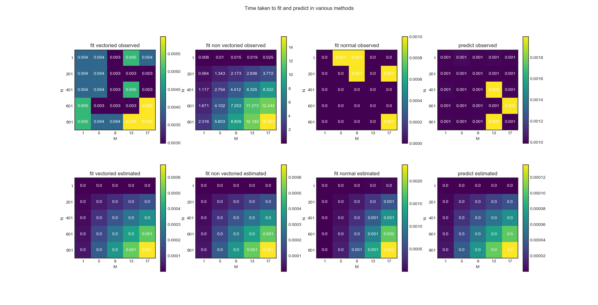

# ES654-2020 Assignment 3

*N. V. Karthikeya* - *17110090*

------

> In thos question I have compared the time complexities of gradient descent and normal method.

> The plot is as follows,

> Interpretation: The observed time is more than that of estimated time in almost all the cases except normal fit as it uses Strassens algorithm to make inverse computation faster and vectorized form is very much faster than non vectorised one, here the normal method seems to take less time because of smaller values of M and N but in practice gradient descent is faster than normal method if the number of features are more, here I tried to increase M and N to get better plots but it was taking lots of time for non vectorized version to fit. The predict time is very close to estimated. The the theroetical complexity of gradient descent is $O(Ndt)$ where t is no. of iterations, N is no. of samples and d is no. of features. Complexity of the normal method is $O(Nd^2)$