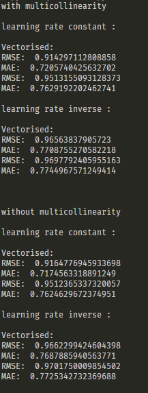

# ES654-2020 Assignment 3

*N.V>Karthikeya* - *17110090*

------

> In this question we are supposed to create a dataset which suffers from multi-collinearity I have added two columns by multipliying 2 existing columns by constants.

>The results are as follows:

> So clearly gradient descent works without any trouble

